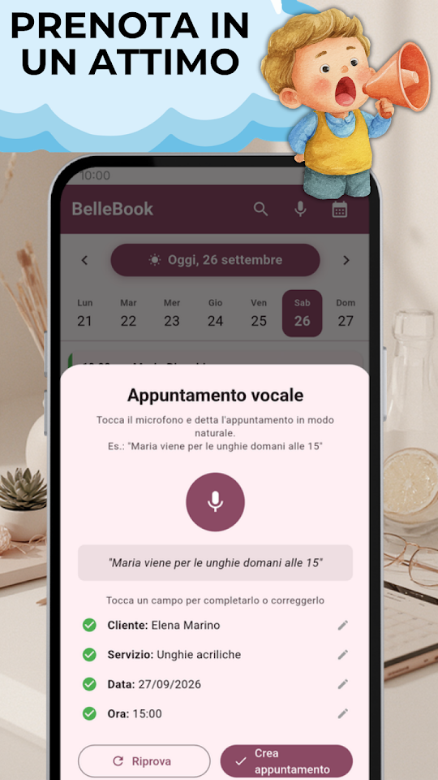
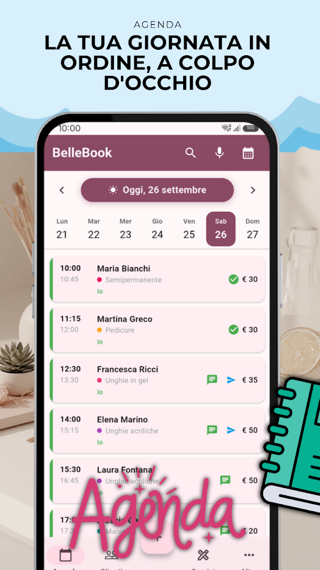
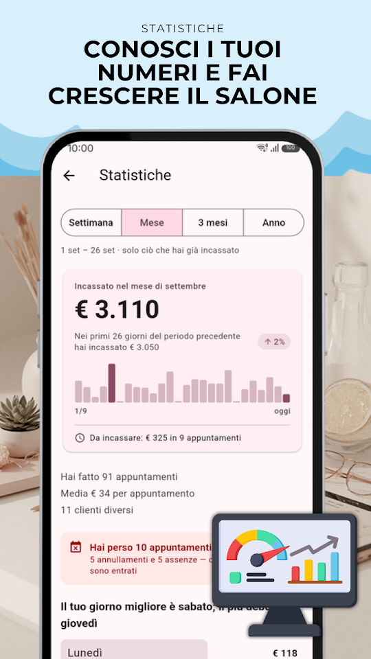
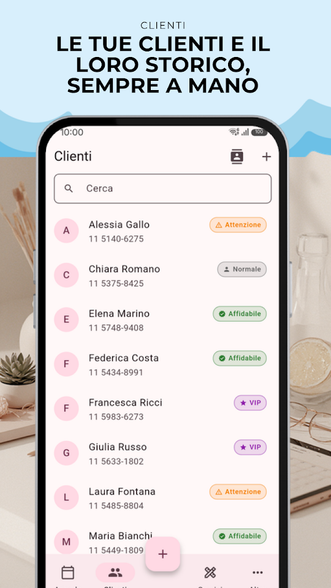

  
  <h1>BelleBook - Agenda Bellezza</h1>
  
<b>🇮🇹 Agenda appuntamenti, clienti e servizi per professionisti della bellezza.</b>

  

  
<a href="README.md">🇦🇷 Español</a> · <a href="README-en.md">🇺🇸 English</a> · <a href="README-pt.md">🇧🇷 Português</a> · 🇮🇹 Italiano

  
  
  
  

Progettata per parrucchiere, estetiste, nail artist e professioniste della bellezza. Gestisci gli appuntamenti, le tue clienti e il tuo business direttamente dallo smartphone.

## 📅 AGENDA INTELLIGENTE

Visualizza tutti gli appuntamenti del giorno in un colpo d'occhio. Scorri tra i giorni, riprogramma con un tocco e invia il promemoria via WhatsApp in un attimo. Aggiungi più servizi allo stesso appuntamento: durata e prezzo si sommano da soli.

## 🎙️ APPUNTAMENTI CON LA VOCE

Hai le mani occupate? Registra appuntamenti parlando. Di' "Maria viene per la manicure domani alle 15" e BelleBook lo registra in automatico.

## 📲 RICHIESTE SU WHATSAPP

Condividi il tuo link o il tuo codice QR perché i clienti ti chiedano un appuntamento su WhatsApp, con il messaggio già scritto. E invia gli orari che hai ancora liberi, pronti con un tocco.

## 👩 GESTIONE CLIENTI

Scheda completa con telefono, email e note personali. Importa i contatti dalla rubrica del telefono con un solo tocco.

## 💬 PROMEMORIA VIA WHATSAPP

Il messaggio viene creato automaticamente con data, ora e servizio. Hai riprogrammato? Ti propone di inviare l'avviso subito.

## 💰 SERVIZI E METRICHE

Configura i tuoi servizi con prezzi e durata e visualizza i guadagni giornalieri e mensili.

## 📊 STORICO COMPLETO

Ogni appuntamento registra promemoria inviati, riprogrammazioni e cancellazioni.

## 🔒 SICUREZZA BIOMETRICA

Proteggi i tuoi dati con impronta digitale o riconoscimento facciale.

## 🇮🇹 DISPONIBILE IN ITALIANO

BelleBook è completamente in italiano — interfaccia, notifiche, promemoria e ogni funzione. Pensata per il mercato italiano, parla la tua lingua.

## GRATUITO — CON PUBBLICITÀ

- Appuntamenti illimitati
- Fino a 50 clienti, 15 servizi e 3 professionisti
- Appuntamenti vocali, promemoria WhatsApp, metriche e biometria
- Link e QR per ricevere richieste su WhatsApp, e orari liberi pronti da inviare

## ⭐ BELLEBOOK PRO

Senza pubblicità. Clienti, servizi e professionisti senza limite, più il backup per portare tutto su un altro telefono. 7 giorni gratis; annulli quando vuoi da Google Play.

Sviluppato da EgeaINC — Gabriel Egea.

---

## 📋 Novità

Tutto ciò che è cambiato, versione per versione: [CHANGELOG](CHANGELOG-it.md).

## 💬 Suggerimenti e problemi

Hai trovato un errore o hai un'idea? Apri una [issue](https://github.com/gabriel600r/bellebook-feedback/issues/new) o scrivici dall'app (Altro → Invia suggerimento o segnalazione).

## 🔒 Privacy

La tua agenda resta solo nel telefono. La versione gratuita mostra annunci Google AdMob; PRO li toglie. Dettagli nell'[informativa sulla privacy](PRIVACY_POLICY.md).
