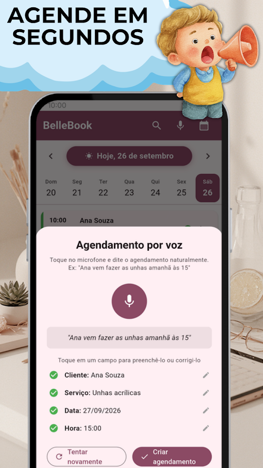
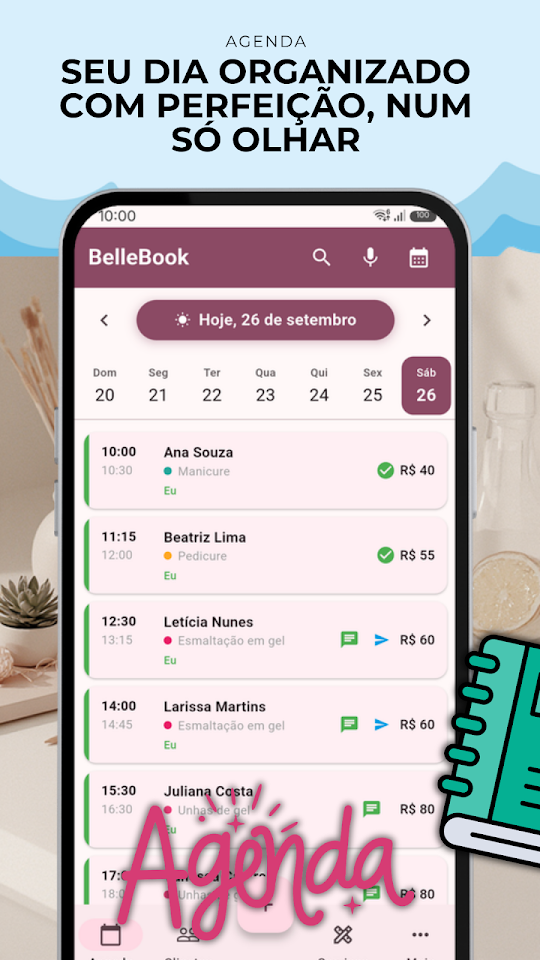
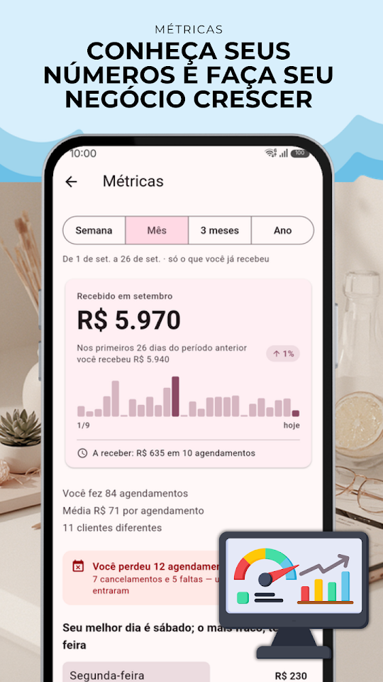
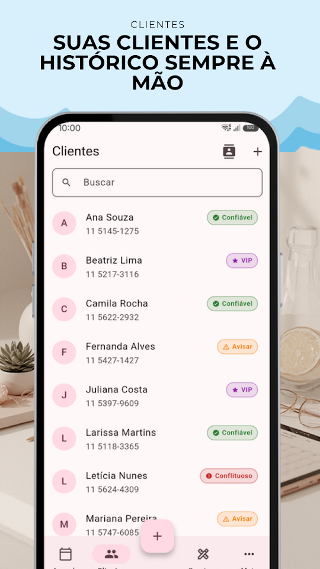

  
  <h1>BelleBook - Agenda Beleza</h1>
  
<b>🇧🇷 Agenda de horários, clientes e serviços — em português!</b>

  

  
<a href="README.md">🇦🇷 Español</a> · <a href="README-en.md">🇺🇸 English</a> · 🇧🇷 Português · <a href="README-it.md">🇮🇹 Italiano</a>

  
  
  
  

Feita para cabeleireiras, manicures, esteticistas e profissionais da beleza. Organize seus horários, gerencie suas clientes e controle seu negócio pelo celular.

## 📅 AGENDA INTELIGENTE

Veja todos os horários do dia de uma vez. Navegue entre dias com um swipe, reagende com um toque e envie o lembrete pelo WhatsApp na hora. Inclua vários serviços no mesmo agendamento: o tempo e o preço se somam sozinhos.

## 🎙️ AGENDAMENTO POR VOZ

Com as mãos ocupadas? Agende falando. Diga "Maria vem fazer as unhas amanhã às 15h" e o BelleBook registra automaticamente.

## 📲 PEDIDOS PELO WHATSAPP

Compartilhe o seu link ou o seu QR code para que os seus clientes peçam um horário pelo WhatsApp, com a mensagem já escrita. E envie os horários que você ainda tem livres, prontos com um toque.

## 👩 GESTÃO DE CLIENTES

Cadastro completo com telefone, e-mail e anotações. Importe contatos direto da agenda do celular.

## 💬 LEMBRETES PELO WHATSAPP

A mensagem é montada automaticamente com data, hora e serviço. Se reagendar, oferece enviar o aviso na hora.

## 💰 SERVIÇOS E MÉTRICAS

Configure serviços com preços e duração e visualize seus ganhos diários e mensais.

## 📊 HISTÓRICO COMPLETO

Cada agendamento tem registro de lembretes, reagendamentos e cancelamentos.

## 🔒 SEGURANÇA BIOMÉTRICA

Proteja suas informações com impressão digital ou reconhecimento facial.

## GRATUITO — COM ANÚNCIOS

- Agendamentos ilimitados
- Até 50 clientes, 15 serviços e 3 profissionais
- Agendamento por voz, lembretes WhatsApp, métricas e biometria
- Link e QR code para receber pedidos pelo WhatsApp, e horários livres prontos para enviar

## ⭐ BELLEBOOK PRO

Sem anúncios. Clientes, serviços e profissionais sem limite, além de backup para levar tudo para outro celular. 7 dias grátis; cancele quando quiser no Google Play.

Desenvolvido por EgeaINC — Gabriel Egea.

## 🇧🇷 APP 100% EM PORTUGUÊS DO BRASIL

O BelleBook foi totalmente traduzido para o português do Brasil. Interface, notificações, lembretes e suporte — tudo no seu idioma.

---

## 📋 Novidades

Tudo o que mudou, versão por versão: [CHANGELOG](CHANGELOG-pt.md).

## 💬 Sugestões e problemas

Encontrou um erro ou tem uma ideia? Abra uma [issue](https://github.com/gabriel600r/bellebook-feedback/issues/new) ou escreva pelo app (Mais → Enviar sugestão ou reporte).

## 🔒 Privacidade

Sua agenda fica só no seu telefone. A versão grátis mostra anúncios do Google AdMob; o PRO tira os anúncios. Detalhes na [política de privacidade](PRIVACY_POLICY.md).
