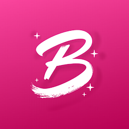
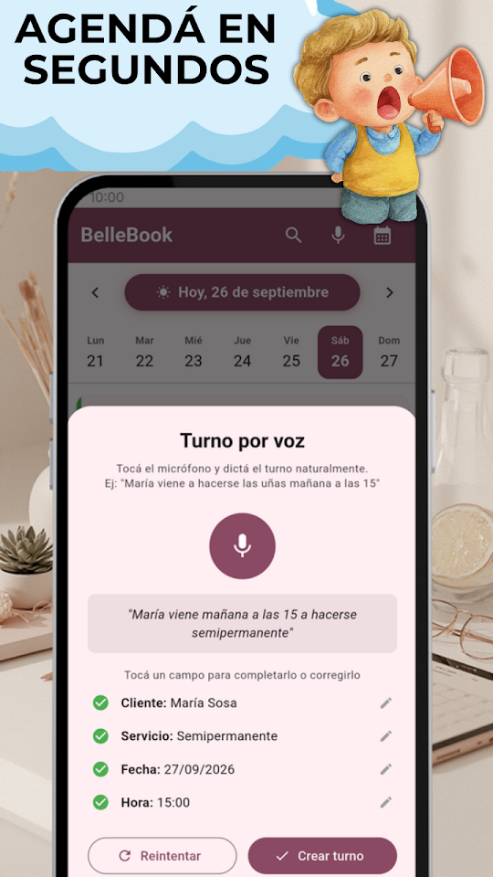
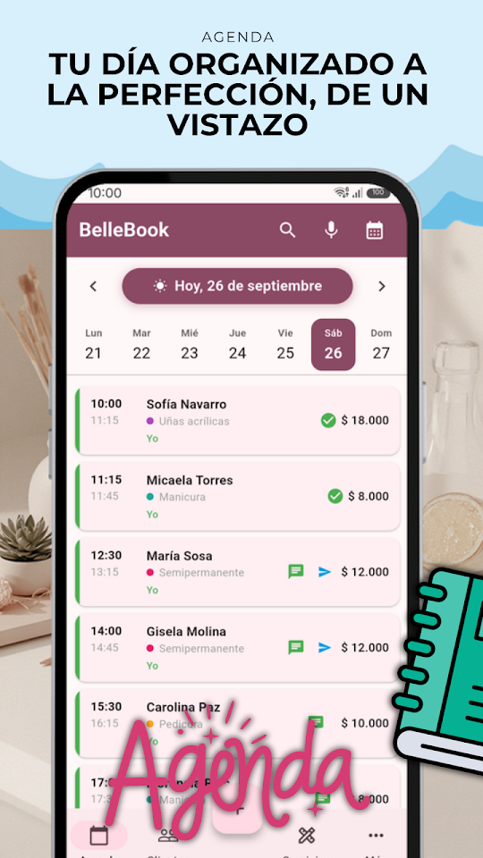
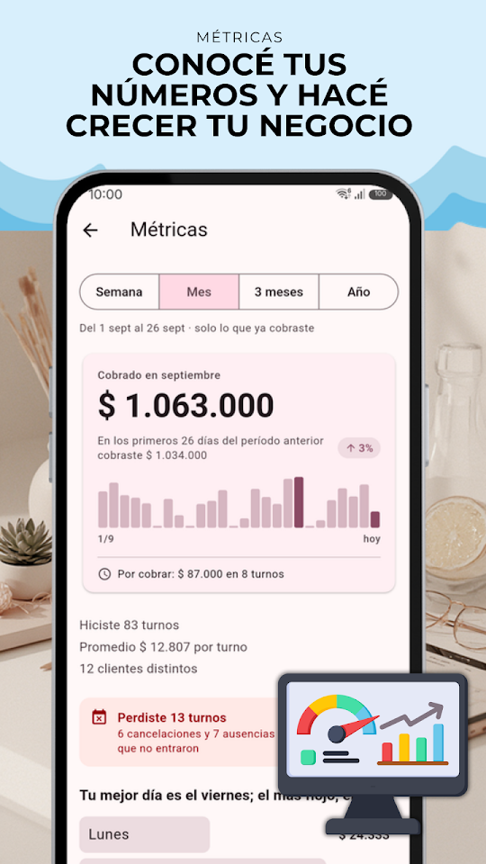
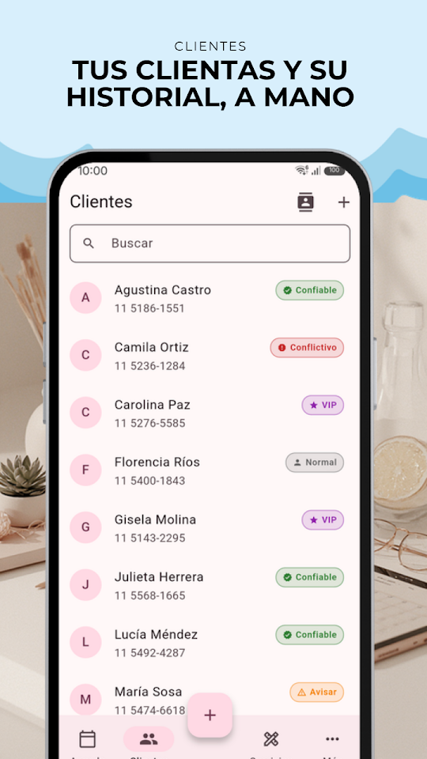

  
  <h1>BelleBook - Agenda Belleza</h1>
  
<b>Agenda de turnos, clientas y servicios para profesionales de la belleza.</b>

  

  
🇦🇷 Español · <a href="README-en.md">🇺🇸 English</a> · <a href="README-pt.md">🇧🇷 Português</a> · <a href="README-it.md">🇮🇹 Italiano</a>

  
  
  
  

Diseñada para peluqueras, manicuristas, estilistas y profesionales de la estética. Organizá tus turnos, gestioná tus clientas y controlá tu negocio, todo desde el celular.

## 📅 AGENDA INTELIGENTE

Visualizá tus turnos del día de un vistazo. Navegá entre días con un swipe, reprogramá citas con un toque y mandá el recordatorio por WhatsApp al instante. Simple, rápida y sin complicaciones.

## 🎙️ TURNOS POR VOZ

¿Tenés las manos ocupadas? Cargá turnos hablando. Decí "María viene a hacerse las uñas mañana a las 15" y BelleBook lo registra automáticamente.

## 👩 GESTIÓN DE CLIENTAS

Registro completo con teléfono, email y notas personales. Importá contactos desde tu agenda del teléfono con un solo toque.

## 💬 RECORDATORIOS POR WHATSAPP

El mensaje se arma solo con fecha, hora y servicio. Si reprogramás, te ofrece enviar el aviso al instante.

## 💰 SERVICIOS Y MÉTRICAS

Definí tus servicios con precios y duración, y mirá tus ganancias diarias y mensuales, los servicios más pedidos y tus mejores clientas.

## 📊 HISTORIAL COMPLETO

Cada turno tiene registro de recordatorios enviados, reprogramaciones y cancelaciones. Todo documentado.

## 🔒 SEGURIDAD BIOMÉTRICA

Protegé tu información con huella dactilar o reconocimiento facial.

## GRATIS — CON PUBLICIDAD

- Turnos ilimitados
- Hasta 50 clientas, 15 servicios y 3 profesionales
- Turnos por voz, recordatorios WhatsApp, métricas y biometría

## ⭐ BELLEBOOK PRO

Sin publicidad. Clientas, servicios y profesionales sin límite, más copia de seguridad para llevarte todo a otro teléfono. 7 días gratis; cancelás cuando quieras desde Google Play.

Desarrollada por EgeaINC — Gabriel Egea.

---

## 📋 Novedades

Todo lo que cambió, versión por versión: [CHANGELOG](CHANGELOG.md).

## 💬 Sugerencias y problemas

¿Encontraste un error o tenés una idea? Abrí un [issue](https://github.com/gabriel600r/bellebook-feedback/issues/new) o escribinos desde la app (Más → Enviar sugerencia o reporte).

## 🔒 Privacidad

Tu agenda se guarda sólo en tu teléfono. La versión gratis muestra publicidad de Google AdMob; PRO la saca. Detalles en la [política de privacidad](PRIVACY_POLICY.md).
